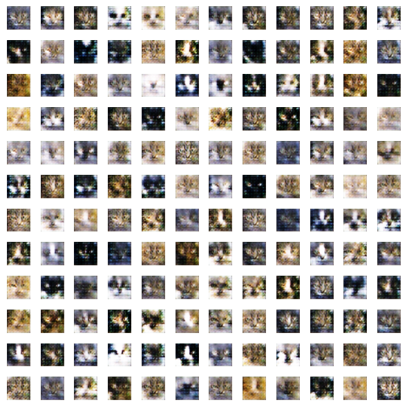
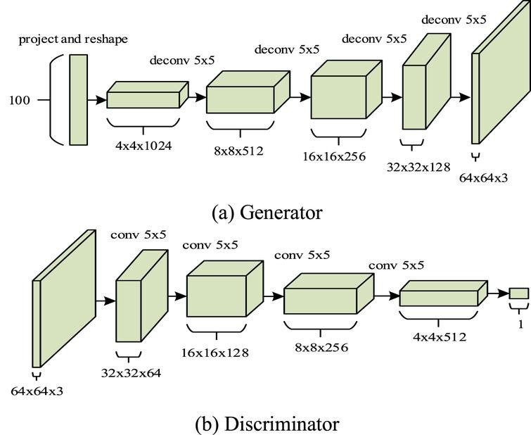

# CAT-DCGAN
Welcome to Cat-DCGAN, a project dedicated to the creation of captivating and realistic fake cat images using Deep Convolutional Generative Adversarial Networks (DCGANs). If you're a cat lover, this repository is the perfect place to explore and generate adorable synthetic cat images. Here are a few images generated by demo.ipynb using the pre-trained model ⬇️  
 

# Dataset
The dataset is taken from Kaggle over [here](https://www.kaggle.com/datasets/spandan2/cats-faces-64x64-for-generative-models). The dataset contains 29,843 images of size 64 by 64 pixels. Please note that the dataset is very noisy; thus, you could potentially achieve better results by cleaning the dataset first.

# Deep Convolutional GAN (DCGAN) Overview:
- Convolutional Layers: Captures spatial hierarchies and patterns in input images.
- Batch Normalization: Stabilizes and accelerates training by normalizing layer inputs.
- Leaky ReLU Activation: Introduces non-linearity to prevent neuron saturation.
- Transpose Convolution: Utilized in the generator to upsample noise and create detailed features.

