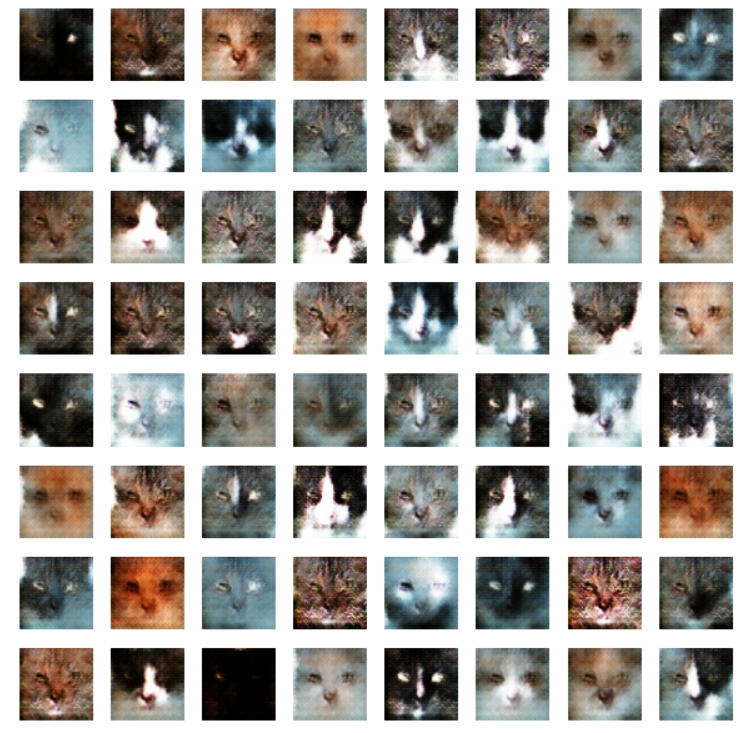

# CAT-DCGAN :raccoon:
Welcome to Cat-DCGAN, a project dedicated to the creation of captivating and realistic fake cat images using Deep Convolutional Generative Adversarial Networks (DCGANs). If you're a cat lover, this repository is the perfect place to explore and generate adorable synthetic cat images. Here are a few images generated by demo.ipynb using the pre-trained model ⬇️  
 

# Dataset
The dataset is taken from Kaggle over [here](https://www.kaggle.com/datasets/spandan2/cats-faces-64x64-for-generative-models). The dataset contains 29,843 images of size 64 by 64 pixels. Please note that the dataset is very noisy; thus, you could potentially achieve better results by cleaning the dataset first.

# Deep Convolutional GAN (DCGAN) 
### Architecture:
- Convolutional Layers: Captures spatial hierarchies and patterns in input images.
- Batch Normalization: Stabilizes and accelerates training by normalizing layer inputs.
- Leaky ReLU Activation: Introduces non-linearity to prevent neuron saturation.
- Transpose Convolution: Utilized in the generator to upsample noise and create detailed features.

### Training:
During each iteration, we sample 200 real cat images and generate 200 corresponding fake images. Subsequently, we apply Stochastic Gradient Descent (SGD) to optimize the objective function. The training process involves initially training the discriminator followed by the generator. Notably, we maintain fixed noise throughout each iteration, avoiding the need for resampling after completing discriminator training. While there is limited research on this approach, our observations suggest that employing fixed noise enhances the stability of the training process.

# Usage 📝
### Requirements ✅
- ##### Python 3.10.11
- ##### Jupyter Notebook
- ##### PyTorch
- ##### torchvision
- ##### matplotlib
### Generate New Images 😺
To generate images, start by cloning the repository using the command git clone https://github.com/CAT-DCGAN.git. Once cloned, run the demo.ipynb notebook. You can also modify the picture size by adjusting the parameters according to your requirements. 
### Train You Own Model 😺
To train your custom model, populate the "training_images" folder with images resized to 64 x 64 pixels. Next, run the GAN_train.ipynb notebook to initiate the training process. This notebook contains all the necessary code and instructions. Keep an eye on the training progress within the notebook, and feel free to fine-tune your model by adjusting hyperparameters or experimenting with different configurations. The repository offers additional functionalities for further exploration. Happy modeling!
   
# Acknowledgements
- The original DCGAN research paper https://arxiv.org/abs/1511.06434
- DCGAN implementation for human faces: https://github.com/Natsu6767/DCGAN-PyTorch
- Anime-Face-GAN https://github.com/yashy3nugu/Anime-Face-GAN/
